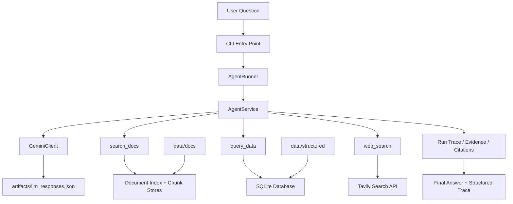

# Architecture

## System Overview

The system is organized around a lightweight orchestrator that decides when to use local documents, structured financial data, or live web search.



## Runtime Sequence

```mermaid
sequenceDiagram
    participant User
    participant CLI
    participant Agent as AgentService
    participant LLM as GeminiClient
    participant SQL as query_data
    participant Docs as search_docs
    participant Web as web_search

    User->>CLI: ask(question)
    CLI->>Agent: run(question)
    Agent->>LLM: understand_question
    LLM-->>Agent: normalized question + mode
    Agent->>LLM: plan
    LLM-->>Agent: subgoals + likely_tools

    loop up to 8 tool calls
        Agent->>LLM: choose_next_action
        LLM-->>Agent: next action
        alt query_data
            Agent->>LLM: build SQL input
            LLM-->>Agent: SQL
            Agent->>SQL: execute query
            SQL-->>Agent: rows/columns
        else search_docs
            Agent->>LLM: build doc query
            LLM-->>Agent: retrieval query
            Agent->>Docs: search local corpus
            Docs-->>Agent: top chunks
        else web_search
            Agent->>LLM: build web query
            LLM-->>Agent: search string
            Agent->>Web: search web
            Web-->>Agent: snippets + URLs
        else answer/refuse
            break
        end

        Agent->>LLM: check_sufficiency
        LLM-->>Agent: continue / answer / refuse
    end

    Agent->>LLM: compose final answer
    LLM-->>Agent: answer + used evidence ids
    Agent-->>CLI: final result object
    CLI-->>User: answer + trace
```

## Component Roles

### CLI

- Parses commands
- Builds indexes and databases
- Runs tool-only commands
- Runs full agent questions

### AgentService

- Owns the control loop
- Maintains state, subgoals, evidence, and trace
- Decides when to stop
- Applies the 8-step hard cap

### GeminiClient

- Handles all LLM-facing stages
- Logs every LLM prompt/response pair to `artifacts/llm_responses.json`
- Supports optional prompt-response caching

### `search_docs`

- Uses chunked local annual reports
- Retrieves document passages with filename and page references
- Supports targeted document filters

### `query_data`

- Loads CSV-backed financial data into SQLite
- Executes read-only SQL generated by the agent
- Returns normalized table output

### `web_search`

- Handles live or recent questions
- Returns result snippets, URLs, and dates when available

## Data Artifacts

- `artifacts/docs_index.json`
  Main document index manifest
- `artifacts/docs_index_metadata.json`
  Corpus metadata used in prompt routing
- `artifacts/structured.db`
  SQLite database built from CSV files
- `artifacts/llm_responses.json`
  Raw LLM-call log for debugging prompt stages

## Termination and Safety

- Hard cap: 8 tool calls
- Read-only SQL restriction
- Explicit refusal path
- Sufficiency check after every tool call
- Trace returned on every run for post-mortem debugging
