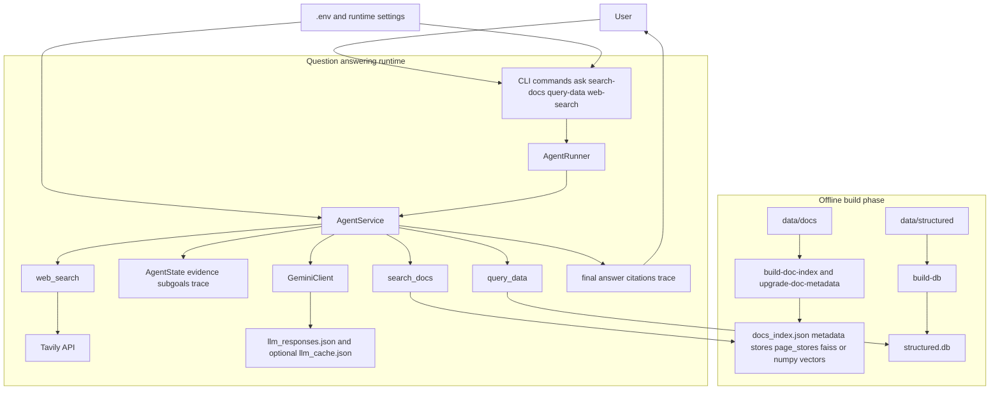
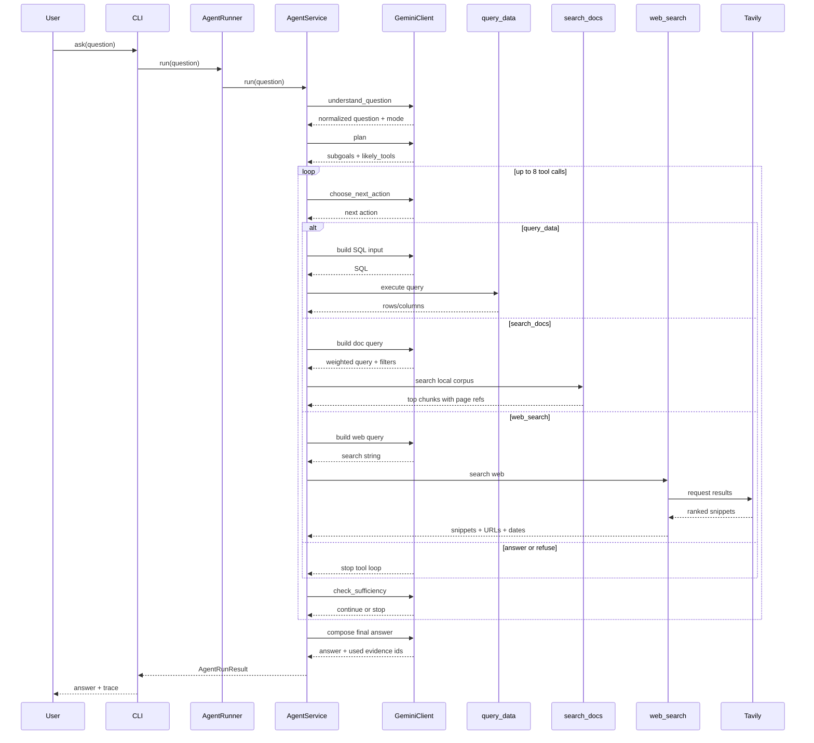

# Architecture

## System Overview

The system is organized around a lightweight orchestrator that decides when to use local documents, structured financial data, or live web search.

## Runtime Sequence

## Component Roles

### CLI

- Parses commands
- Builds indexes and databases
- Runs tool-only commands
- Runs full agent questions
- Loads runtime settings from `.env`

### AgentService

- Owns the control loop
- Maintains state, subgoals, evidence, and trace
- Decides when to stop
- Applies the 8-step hard cap
- Routes between document search, SQL lookup, and web search

### GeminiClient

- Handles all LLM-facing stages
- Logs every LLM prompt/response pair to `artifacts/llm_responses.json`
- Supports optional prompt-response caching

### `search_docs`

- Uses chunked local annual reports
- Retrieves document passages with filename and page references
- Supports targeted document filters
- Uses the global manifest plus per-document stores and page-topic stores

### `query_data`

- Loads CSV-backed financial data into SQLite
- Executes read-only SQL generated by the agent
- Returns normalized table output

### `web_search`

- Handles live or recent questions
- Returns result snippets, URLs, and dates when available

## Data Artifacts

- `artifacts/docs_index.json`
  Main document index manifest
- `artifacts/docs_index_metadata.json`
  Corpus metadata used in prompt routing
- `artifacts/docs_index_stores/`
  Per-document chunk stores with FAISS or NumPy-backed embeddings
- `artifacts/docs_index_page_stores/`
  Per-document page-topic stores used for page-aware retrieval narrowing
- `artifacts/structured.db`
  SQLite database built from CSV files
- `artifacts/llm_cache.json`
  Optional JSON cache for repeated LLM calls
- `artifacts/llm_responses.json`
  Raw LLM-call log for debugging prompt stages

## Termination and Safety

- Hard cap: 8 tool calls
- Read-only SQL restriction
- Explicit refusal path
- Sufficiency check after every tool call
- Trace returned on every run for post-mortem debugging
